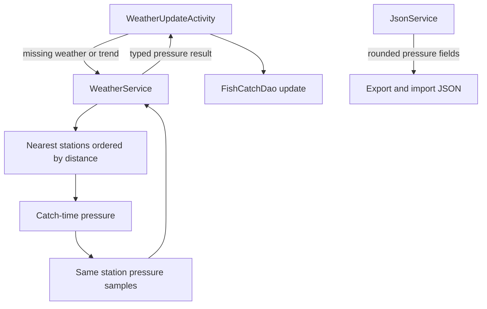

# Requirements

### Overview & Goals
Laajennetaan **Päivitä puuttuvat säätiedot** -toiminto täydentämään `FishCatch.pressureTrend`- ja `pressureSamples`-tiedot niille saalispisteille, joilta trendi puuttuu. Käytetty asema valitaan samoilla lähimmän aseman fallback-säännöillä kuin nykyisessä säähaussa, ja paineen hetkellinen arvo sekä painehistoria haetaan samalta asemalta.

### Scope
#### In scope
- Lisää `pressureTrend` puuttuvien säätietojen päivityskohteisiin ja näytä nämä pisteet nykyisessä `Päivitettäviä pisteitä`-laskurissa.
- Kokeile saantihetken ilmanpainetta asemilta etäisyysjärjestyksessä ja hae `pressureSamples` samalta asemalta.
- Laske trendi olemassa olevan `FishCatch.calculatePressureTrend()`-logiikan perusteella.
- Säilytä kaikki muut sääarvot ennallaan, kun piste tarvitsee vain paineeseen liittyvän päivityksen.
- Vie ja tuo `pressureTrend` sekä `pressureSamples.pressure` enintään viiden desimaalin tarkkuudella.

#### Out of scope
- Painehistoria- ja trendikenttien Room-skeeman muuttaminen; niiden kentät ja `PressureConverter` ovat jo olemassa.
- Uuden käyttöliittymän lisääminen; käytetään nykyistä päivitysnäkymää ja laskuria.
- Muiden automaattisten sääpäivityspolkujen muuttaminen kuin niiden kanssa jaettavan sääasemalogiiikan tarpeelliset sisäiset muutokset.

#### Yritysseurannan lisäys
- Lisää erillinen Room-yritystaulu puuttuvien säätietojen päivityksille ilman aikaperusteista viivettä.
- Näytä viimeisellä päivitysyrityksellä epäonnistuneiden pisteiden määrä nykyisen päivitettävien pisteiden laskurin yhteydessä.
- Valitse ensin pisteet, joilla ei ole epäonnistunutta viimeisintä yritystä, ja vasta sen jälkeen viimeksi epäonnistuneet pisteet.

### Functional Requirements
- Piste on päivitettävä, jos sillä on kelvollinen `caughtAt` ja joko:
  - normaaleja saantihetken säätietoja puuttuu nykyisen ehdon mukaan, tai
  - `pressureTrend == null`, riippumatta siitä, onko `weatherDataCompleteTime` jo asetettu.
- Massapäivityksen on käsiteltävä erikseen nämä tilanteet:
  - uusi piste: haetaan nykyisen normaalin sääpäivityksen tapaan säätiedot sekä paineen näytteet ja lasketaan trendi samaan tallennukseen;
  - vanha piste, jolta `pressure` puuttuu kokonaan: haetaan puuttuva saantihetken paine, `pressureSamples` ja `pressureTrend`, mutta säilytetään kaikki muut jo tallennetut tiedot;
  - vanha piste, jolla `pressure` on olemassa mutta painehistoria/trendi puuttuu: haetaan painehistoria samalta saantihetken paineen tuottavalta asemalta ja täydennetään `pressureSamples` sekä `pressureTrend` ilman muiden sääarvojen korvaamista.
- Painehaku kokeilee lähimmät käytettävissä olevat asemat nykyisen `WeatherService`-logiikan mukaisessa järjestyksessä ja jatkaa seuraavaan asemaan, jos saantihetken paine-/historiatietoa ei saada.
- `pressureSamples` ja saantihetken `pressure` tulevat samasta käytetystä asemasta; asemien tietoja ei yhdistetä painehistorian sisällä.
- Paine-only-päivitys saa muuttaa vain paineeseen liittyviä kenttiä (`pressure`, `pressureSamples`, `pressureTrend`); esimerkiksi lämpötila, tuuli, sade, `weatherStation`, `weatherTime` ja muut kalatiedot säilyvät.
- Jos näytteitä ei saada tai näytteitä on liian vähän trendin laskemiseen, `pressureTrend` jää puuttuvaksi eikä pistettä merkitä onnistuneesti täydennetyksi.
- JSON-viennissä ja -tuonnissa `pressureTrend` sek�� jokaisen `pressureSamples`-alkion paine normalisoidaan enintään viiteen desimaaliin; puuttuvat vanhan JSON-muodon kentät säilyvät yhteensopivina.
- Jokaisesta päivitysyrityksestä säilytetään viimeisin tila catch-kohtaisesti; onnistunut yritys poistaa pisteen epäonnistuneiden joukosta ja epäonnistunut yritys merkitään ilman seuraavan yrityksen aikaviivettä.
- Päivitysrajoitteen täyttyessä valitaan ensin kaikki ei-epäonnistuneet kohteet ja vasta sen jälkeen viimeksi epäonnistuneet kohteet.
- Laskuri näyttää muodossa `Päivitettäviä pisteitä: n / m` lisäksi viimeisellä yrityksellä epäonnistuneiden pisteiden määrän.

# Technical Design

### Current Implementation
- `FishCatch.kt` sisältää jo `pressureTrend`- ja `pressureSamples`-kentät sekä `calculatePressureTrend()`, joka laskee ensimmäisen ja viimeisen näytteen välisen hPa/h-muutoksen.
- `WeatherUpdateActivity.kt` valitsee nykyisin vain pisteet, joilta puuttuu perustason säädata, ja muodostaa päivityksen `copy`-kutsulla kaikista normaaleista sääarvoista. Se ei vielä käsittele painehistoriaa tai trendiä.
- `WeatherService.kt` toteuttaa `fetchNearestStationsSuspend()`-haun enintään viidelle, enintään 300 km:n päässä olevalle asemalle sekä `fetchPressureSamplesSuspend()`-historian haun tietylle `fmisid`-tunnukselle. Nykyinen moniasemahaku palauttaa vain tekstimuotoisen asematiedon.
- `JsonService.kt` vie kentät jo avaimilla `pressureTrend` ja `pressureSamples` ja tuo ne `parseCatches()`/`parsePressureSamples()`-poluissa, mutta ei rajoita painearvojen desimaaleja.
- `AppDatabase.kt`, `FishCatchDao.kt` ja `PressureConverter.kt` tukevat kenttiä jo nykyisellä tietokantaversiolla.

### Key Decisions
- **Painehaun vastuu `WeatherService`-kerrokseen:** lisätään erillinen suspend-haku, joka kapseloi lähimpien asemien läpikäynnin, saantihetken paineen varmennuksen ja saman aseman pressureSamples-haun. `WeatherUpdateActivity` ei parsii `weatherStation`-tekstikenttää.
- **Typed station result:** painehaku palauttaa käytetyn `WeatherStation`/`fmisid`-tiedon yhdessä painearvon ja näytteiden kanssa, jotta historiaa ei haeta eri asemalta kuin saantihetken paine.
- **Selektiivinen tallennus:** normaalia puuttuvan sään päivityshaaraa laajennetaan paineen tiedoilla, mutta trendi-only-pisteelle rakennetaan `FishCatch.copy` vain painekentistä. Nykyinen `fetchWeatherFromMultipleStationsSuspend`-rajapinta säilytetään `EditCatchActivity`-käyttöä varten.
- **JSON-tarkkuus rajataan palvelutasolla:** `JsonService` pyöristää painearvot viiteen desimaaliin sekä kirjoittaessa että luettaessa; Roomin sisäistä listamuunnosta ei muuteta.

### Proposed Changes
1. **`WeatherService.kt`**
   - Lisää painepäivityksen tulosmalli, jossa ovat käytetty asema, saantihetken paine ja `List<PressureSample>`.
   - Lisää suspend-metodi, joka käyttää `fetchNearestStationsSuspend()`-järjestystä, hakee jokaiselta ehdokkaalta saantihetken säähavainnon ja käyttää saman aseman `fmisid`-tunnusta `fetchPressureSamplesSuspend()`-hakuun.
   - Jatka seuraavaan asemaan, jos tarvittavaa painehavaintoa tai käyttökelpoista historiadataa ei saada; pidä sama ±6 tunnin aikaväli kuin `EditCatchActivity.kt`:ssä (`caughtAt - 6 h` ... `min(caughtAt + 6 h, now)`).
   - Pidä nykyisen normaalin moniasemahaun ulkoinen `Triple`-rajapinta yhteensopivana ja jaa tarvittaessa sisäinen asemanvalinnan apulogiikka sen kanssa.

2. **`WeatherUpdateActivity.kt`**
   - Yhtenäistä nykyinen kohdefiltteri niin, että `pressureTrend == null` lisää pisteen päivitettäväksi myös silloin, kun normaali sääpäivitys on jo merkitty valmiiksi.
   - Päivitä `Päivitettäviä pisteitä` -laskuri käyttämään samaa ehtoa kuin varsinainen päivitysajo.
   - Käynnistä painehaku jokaiselle trendittömälle pisteelle ja laske saatu trendi `pressureSamples`-listasta `calculatePressureTrend()`-metodilla.
   - Käsittele uuden tai muuten normaalisti puutteellisen pisteen kohdalla koko sääpäivitys yhtenä `FishCatch`-päivityksenä, johon liitetään paine, näytteet ja trendi.
   - Käsittele vanha täysin paineeton piste paine-only-päivityksenä silloin, kun muu säädata on jo valmis; täydennä vain `pressure`, `pressureSamples` ja `pressureTrend`.
   - Käsittele vanha piste, jolla on jo `pressure` mutta ei painehistoriaa/trendiä, hakemalla näytteet WeatherServicen valitsemalta samalta asemalta ja säilyttämällä kaikki muut kentät ennallaan.
   - Säilytä nykyinen normaali sääpäivitys puuttuville perustiedoille, mutta yhdistä siihen painehaun tulos ilman että tyhjät tai epäonnistuneet painehaut pyyhkivät olemassa olevia arvoja.
   - Käsittele osittainen onnistuminen, tyhjä historiavastaus ja virhe nykyisen onnistumis-/epäonnistumis- ja `WeatherError`-mallin mukaisesti; trendiä ei merkitä valmiiksi ilman laskettavaa tulosta.

3. **`JsonService.kt`**
   - Lisää keskitetty enintään viiden desimaalin `Double`-normalisointi `pressureTrend`-arvolle ja `PressureSample.pressure`-arvolle.
   - Käytä samaa normalisointia `catchesToJson()`-viennissä ja `parseCatches()`/`parsePressureSamples()`-tuonnissa.
   - Säilytä ISO-aikaleimat, tyhjien näytelistojen käsittely ja vanhojen JSON-tiedostojen puuttuvien kenttien oletukset.

### Components & File Structure
- Muokattavat: `app/src/main/java/fi/anssi/kalakartta/utils/WeatherService.kt`, `app/src/main/java/fi/anssi/kalakartta/ui/WeatherUpdateActivity.kt`, `app/src/main/java/fi/anssi/kalakartta/data/JsonService.kt`.
- Testit: `app/src/test/java/fi/anssi/kalakartta/data/JsonCompatibilityTest.kt` ja `app/src/test/java/fi/anssi/kalakartta/data/PressureCatchTest.kt`.
- Ennalleen: `FishCatch.kt`, `PressureConverter.kt`, `AppDatabase.kt` ja `FishCatchDao.kt`, ellei toteutuksessa tarvitse vain jakaa olemassa olevaa sisäistä apumallia.

### Architecture Diagram

# Testing

### Validation Approach
- Aja projektin JVM-yksikkötestit ja varmista, että olemassa olevat trendin laskenta- ja JSON-yhteensopivuustestit säilyvät vihreinä.
- Tarkista kooditasolla, että laskurin ja päivitysajon kohdefiltteri käyttävät samaa ehtoa eivätkä sisällytä pisteitä, joilla sekä perustason sää että `pressureTrend` ovat kunnossa.

### Key Scenarios
- Uusi piste: normaali säähaku täyttää perustiedot, paineen ja painehistorian, ja `pressureTrend` lasketaan samaan `FishCatch`-päivitykseen.
- Vanha piste ilman `pressure`-arvoa: piste näkyy päivitettävissä, paineen fallback-haku suoritetaan, ja vain paineeseen liittyvät puuttuvat kentät täydennetään muun tiedon säilyessä.
- Vanha piste, jolla on `pressure` mutta ei `pressureSamples`-/`pressureTrend`-tietoa: historia haetaan samalta saantihetken paineen asemalta, trendi lasketaan ja muut sääarvot säilyvät.
- Saalispisteeltä puuttuu vain `pressureTrend`: se näkyy laskurissa, pressure-haku kokeilee asemat järjestyksessä, trendi lasketaan näytteistä ja muut sääarvot säilyvät muuttumattomina.
- Lähin asema ei palauta saantihetken painetta tai historiaa: seuraava asema kokeillaan, ja onnistuneessa tapauksessa paine sekä näytteet tulevat samalta asemalta.
- Pisteeltä puuttuu sekä normaaleja säätietoja että trendi: normaali sääpäivitys ja painepäivitys tallentuvat samaan `FishCatch`-päivitykseen.
- Painehistoria on tyhjä tai siinä on vain yksi kelvollinen näyte: trendiä ei aseteta eikä pistettä käsitellä onnistuneesti täydennettynä.
- Viety trendi ja näytteiden paineet sisältävät yli viisi desimaalia: JSON-arvot sisältävät enintään viisi desimaalia ja tuonti palauttaa viiteen desimaaliin normalisoidut `Double`-arvot.
- Vanha JSON ilman `pressureTrend`- ja `pressureSamples`-kenttiä tuodaan edelleen `null`-/tyhjälista-oletuksilla.

### Test Changes
- Laajenna `JsonCompatibilityTest.kt`: tarkista trendin ja sample-paineiden vienti/tuonti viiden desimaalin rajalla, usean näytteen round-trip sekä vanhan JSON:n yhteensopivuus.
- Laajenna `PressureCatchTest.kt`: varmista, että päivitetystä sample-listasta laskettu nouseva ja laskeva trendi on odotettu ja että liian lyhyt lista palauttaa `null`.
- Lisää tarvittaessa puhdas testattava apumalli/valintafunktio `WeatherService`-asemafallbackille, jotta järjestys, saman aseman käyttö ja tyhjän vastauksen jatkaminen voidaan varmistaa ilman verkkoyhteyttä.

# Delivery Steps

### ✓ Step 1: Add typed pressure-station fallback to WeatherService
`WeatherService` can return catch-time pressure and pressure samples from one station selected by nearest-station fallback.

- Add the pressure update result model and suspend method in `app/src/main/java/fi/anssi/kalakartta/utils/WeatherService.kt`.
- Reuse `fetchNearestStationsSuspend()` ordering and the existing 300 km/active-station filtering.
- Try catch-time pressure and then the ±6-hour pressure history on the same candidate station before moving to the next candidate.
- Keep the existing `fetchWeatherFromMultipleStationsSuspend()` contract usable by `EditCatchActivity.kt`.

### ✓ Step 2: Integrate pressure trend updates into WeatherUpdateActivity
`Päivitä puuttuvat säätiedot` counts and updates new points plus both pressure-missing legacy cases without overwriting unrelated weather fields.

- Update the target predicate in `app/src/main/java/fi/anssi/kalakartta/ui/WeatherUpdateActivity.kt` and use it for both the count and the update loop.
- Handle new or otherwise weather-incomplete points with the existing full weather update and attach the pressure result to the same save.
- Handle old points without `pressure` through a pressure-only save that fills `pressure`, `pressureSamples`, and `pressureTrend`.
- Handle old points with `pressure` but without pressure history by fetching samples from the same selected station and retaining all non-pressure fields.
- Call the new `WeatherService` pressure lookup for trendless points and calculate the value with `FishCatch.calculatePressureTrend()`.
- Combine pressure results with the existing normal weather update for points that also lack other weather values, while preserving current error and progress reporting.

### ✓ Step 3: Normalize JSON pressure precision and regression coverage
Exports and imports preserve pressure trend data with no more than five decimal places and cover the new update contracts with tests.

- Update `app/src/main/java/fi/anssi/kalakartta/data/JsonService.kt` to round `pressureTrend` and sample pressure values on both export and import.
- Extend `JsonCompatibilityTest.kt` with precision, round-trip, and old-format cases.
- Extend `PressureCatchTest.kt` for trend calculation edge cases and run the existing JVM test suite.

### ✓ Step 4: Add persistent weather-update attempt tracking
Each catch has durable last-attempt state for the missing-weather mass update, with no time-based retry delay.

- Add a Room entity, DAO, database registration, and migration for one latest attempt record per catch.
- Store whether the latest attempt succeeded and enough metadata to distinguish the latest result.
- Keep the existing `WeatherError` history separate from the latest attempt state.

### ✓ Step 5: Prioritize and display failed update attempts
The update screen reports the latest failed count and processes non-failed targets before failed targets.

- Use the same target predicate for the total count and update loop, then order targets by latest attempt result before applying the user limit.
- Record success after a complete update and failure for every incomplete or thrown attempt, including pressure-history failures.
- Display `Viime yrityksellä epäonnistuneita n kpl` alongside `Päivitettäviä pisteitä: n / m`.

### ✓ Step 6: Verify retry ordering and failure-state behavior
Tests cover persistence, ordering, count calculation, and the no-delay retry contract.

- Add unit coverage for latest-attempt DAO behavior and non-failed-before-failed ordering.
- Verify that failed points remain eligible immediately but are selected only after eligible points without a failed latest attempt.
- Run the relevant JVM tests and compile checks.