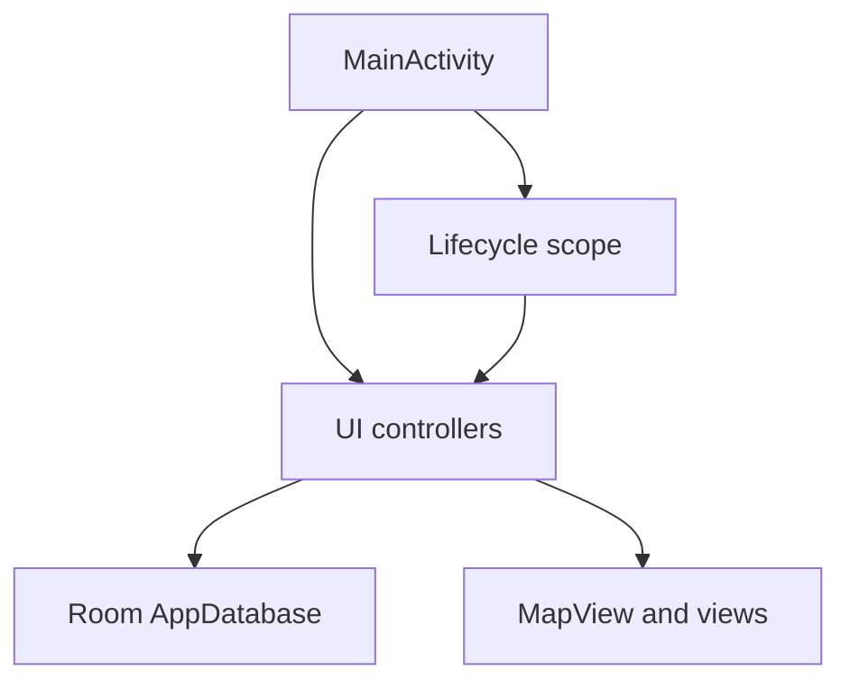

# Requirements

### Tavoite
Viedään refaktorointia eteenpäin turvallisesti korjaamalla a13f697-refaktoroinnin jälkeiset regressiot ja sitomalla UI-työt oikein `Activity`-elinkaareen. Toteutus tehdään inkrementaalisesti nykyisten controllerien jatkona ilman uutta `Coordinator`- tai `ViewModel`-kerrosta.

### Sisältö
- Sääasema näytetään, kun sää on käytössä ja lähin asema löytyy; näkymä piilotetaan, kun sää on pois käytöstä tai asemaa ei ole.
- Tietokannan migraatio-/avausvirhe ei enää vaihda sovellusta tyhjään muistipohjaiseen tietokantaan. Normaali tietojen käyttö estetään ja käyttäjälle näytetään selkeä uudelleenyritys-/sulkemisohjeistus ilman tietojen hiljaista katoamisriskiä.
- `MarkerManager`in taustatyöt peruuntuvat `MainActivity`n tuhoutuessa, eivätkä vanhat `Activity`-, `MapView`- tai callback-viitteet jää elämään.
- Järjestelmän sijainti- ja näyttölähetykset sekä sovelluksen omat sessiolähetykset rekisteröidään oikeilla Android 13+ -vastaanottajalipuilla.
- Arkistoidun session näyttäminen normaalina reittiviivana pysäyttää mahdollisen replayn, piilottaa replay-soittimen ja palauttaa markerien aikarajauksen johdonmukaisesti.
- `MainActivity`n alustusta ja elinkaarikäsittelyä selkeytetään vain siltä osin kuin edellä mainitut vastuut sitä tarvitsevat.

### Rajaus
**Sisältyy:** `MainActivity`, `WeatherController`, `ReplayMapController`, `MarkerManager`, `LocationController`, `FishingSessionController`, tarvittavat puhtaat testit sekä `activity_main.xml` vain jos näkyvyyden oletuksia täytyy täsmentää.

**Ei sisälly:** `ImportExportManager`in, `FilterManager`in tai `SettingsManager`in laaja uudelleenarkkitehtuuri; niiden pilkkominen tehdään myöhemmässä erillisessä kierroksessa. Myöskään uutta yleistä tilanhallintakehystä ei tuoda tähän muutokseen.

# Technical Design

### Nykyinen toteutus
- `MainActivity.onCreate()` (`MainActivity.kt:133–603`) rakentaa tietokannan, kahdeksan controller-/manager-riippuvuutta, intentit, kartan listenerit ja asetusten migraatiot samaan alustuskulkuun.
- `MainActivity.kt:176–193` luo `Room.inMemoryDatabaseBuilder`-fallbackin, jos `AppDatabase.getInstance()` epäonnistuu. `AppDatabase.kt` käyttää singletonia ja version 23 migraatioketjua.
- `WeatherController.updateWeatherUi()` (`WeatherController.kt:51–54`) piilottaa `weatherStationText`-näkymän aina, vaikka `lastFoundStation` tallennetaan onnistuneessa haussa. Olemassa oleva `activity_main.xml:180–191` sisältää jo oikean tekstinäkymän.
- `ReplayMapController.showArchivedSessionOnMap()` (`ReplayMapController.kt:101–117`) lataa normaalin reitin, mutta ei pysäytä käynnissä olevaa `replayJob`ia tai päivitä replay-UI:n näkyvyyttä.
- `MarkerManager.kt:45` omistaa oman peruuttamattoman `CoroutineScope`n, vaikka muu pääruudun työ käyttää `lifecycleScope`a.
- `LocationController.kt:188–214` käyttää `RECEIVER_NOT_EXPORTED`-lippua järjestelmälähetyksille; `FishingSessionController.kt:91–96` käyttää `RECEIVER_EXPORTED`-lippua sovelluksen omille `FishingSessionService`-lähetyksille.

### Arkkitehtuuripäätökset
- **Vaiheittainen purku:** säilytetään nykyiset `LocationController`, `WeatherController`, `ReplayMapController`, `FishingSessionController`, `MapDisplayController` ja `MapNavigationController`; muutetaan niiden rajapintoja vain elinkaaren ja tilasiirtymien korjaamiseksi.
- **Tietokantavirheen fail-closed-käsittely:** poistetaan tyhjä tietokantafallback, alustetaan controllerit vain onnistuneen `AppDatabase`-avaamisen jälkeen ja tarjotaan käyttäjälle uudelleenyritys/sulkeminen sekä selkeä varoitus mahdollisesta uudelleenasennuksesta.
- **Yksi elinkaaren omistaja:** injektoidaan `MainActivity`n `lifecycleScope` `MarkerManager`ille tai lisätään vastaava eksplisiittinen `close()`-rajapinta; `rebuildJob` ja media-/infowindow-työt peruuntuvat ennen Activityn poistumista.
- **Explicit replay-tilasiirtymä:** erotetaan replayn pysäyttäminen normaalin arkistoreitin näyttämisestä, jotta reittiviiva säilyy mutta soitin, toistoaika ja markerien replay-rajaus eivät jää päälle.

### Ehdotetut muutokset
1. **Sää-UI:** `WeatherController.updateWeatherUi()` muodostaa tekstin `lastFoundStation.name`-arvosta, näyttää näkymän vain onnistuneella asemalla ja käsittelee force-/asetusten poistot tyhjentämällä vanhan aseman. Päivitetään tarvittaessa `WeatherController`iin puhdas label-/näkyvyysfunktio, jota voidaan testata ilman Android-näkymää.
2. **Tietokannan startup:** eristetään `MainActivity`n tietokannan alustaminen ja virhe-dialogi omiin yksityisiin apumetodeihin. Epäonnistumisessa ei luoda `Room.inMemoryDatabaseBuilder`-kantaa, vaan alustuskulku keskeytetään ja käyttäjä voi yrittää uudelleen tai sulkea ruudun; Crashlytics-kirjaus säilytetään.
3. **Elinkaari:** muutetaan `MarkerManager` käyttämään Activityn elinkaariscopea tai eksplisiittisesti suljettavaa scopea, perutaan `rebuildJob` ja estetään UI-callbackit sulkemisen jälkeen. Kytketään sulkeminen `MainActivity.onDestroy()`-polkuun ilman markerien normaalia toiminnallista muutosta.
4. **Broadcastit:** muutetaan `LocationController`in järjestelmälähetysten rekisteröinti järjestelmältä vastaanotettavaksi sopivaksi ja `FishingSessionController`in sessiolähetys `RECEIVER_NOT_EXPORTED`-muotoon API 33+:lla; vanhojen Android-versioiden deprekoidut haarat säilytetään yhteensopivina.
5. **Replay:** lisätään `ReplayMapController`iin yhteinen lataus-/toistojobin peruutus, joka kutsutaan ennen normaalin arkistoreitin latausta; pysäytetään `SessionReplayController`, piilotetaan `replayPlayerLayout`, palautetaan `addCatchButton` ja kutsutaan `onReplayVisibilityChanged`. Tarvittaessa latauksille pidetään erillinen `Job`, jotta vanha IO-tulos ei voi kirjoittaa uuden tilan päälle.
6. **`MainActivity`n purku:** pidetään callback-sopimukset ennallaan, mutta siirretään tietokannan alustuksen, virhetilan ja elinkaaren siivouksen toistuva logiikka nimettyihin apumetodeihin. Poistetaan vain todetut turhat välitykset ja päällekkäiset tilalukemat; `ImportExportManager`, `FilterManager` ja `SettingsManager` jätetään myöhempään kierrokseen.

### Muutettavat tiedostot
- `app/src/main/java/fi/anssi/kalakartta/MainActivity.kt`
- `app/src/main/java/fi/anssi/kalakartta/ui/WeatherController.kt`
- `app/src/main/java/fi/anssi/kalakartta/ui/ReplayMapController.kt`
- `app/src/main/java/fi/anssi/kalakartta/ui/MarkerManager.kt`
- `app/src/main/java/fi/anssi/kalakartta/ui/LocationController.kt`
- `app/src/main/java/fi/anssi/kalakartta/ui/FishingSessionController.kt`
- tarvittaessa `app/src/main/res/layout/activity_main.xml`
- asiaankuuluvat `app/src/test/java/fi/anssi/kalakartta/ui/*`-testit

### Riskit ja suojaukset
- Tietokantavirheen pysäyttäminen voi näyttää aiempaa ankarammalta, mutta se estää tyhjään kantaan kirjoittamisen ja tietojen katoamisen illuusion.
- `onResume()`- ja `onPause()`-kutsujen toistuvuus voi rekisteröidä lähetyksiä useita kertoja; olemassa olevat unregister-haarat säilytetään ja rekisteröinnin idempotenssi tarkistetaan.
- Replayn ja normaalin arkistoreitin peräkkäiset IO-lataukset voivat valmistua väärässä järjestyksessä; latausjobin peruutus ja tarvittaessa request-tunniste estävät vanhan tuloksen soveltamisen.

### Tavoiteltu riippuvuussuunta

# Testing

### Validointi
- Ajetaan olemassa oleva JVM-testikokonaisuus Gradlen `:app:testDebugUnitTest`-tehtävällä ja varmistetaan, ettei refaktorointi riko `SessionReplayControllerTest`, sääpalvelun URL-testejä tai markerien puhtaita laskentatestejä.
- Lisätään puhtaat testit sääaseman tekstin/näkyvyyden päätökselle: onnistunut asema, puuttuva asema, sää pois käytöstä ja force-päivityksen jälkeinen tyhjä tila.
- Laajennetaan `SessionReplayControllerTest`-testejä varmistamaan, että replayn pysäytys tyhjentää toistotilan; controllerin UI-integraatio tarkistetaan Android-rakennuksella ja smoke-polulla.
- Tarkistetaan staattisesti, ettei `MainActivity` enää rakenna in-memory-tietokantaa eikä `MarkerManager` luo Activitysta riippumatonta peruuttamatonta scopea.

### Smoke-skenaariot
- Käynnistä sovellus normaalilla tietokannalla, odota sijaintia/sääasemaa ja varmista, että `weatherStationText` näyttää aseman nimen; kytke sää pois ja varmista piilotus.
- Simuloi tai testaa tietokannan avaus-/migraatiovirhe ja varmista, ettei kartan normaali käyttö tai tyhjäkantaan kirjoittaminen käynnisty.
- Aloita replay, avaa sen jälkeen sama tai toinen sessio normaalina reittinä ja varmista, että soitin pysähtyy/piiloutuu, add-catch-toiminto palautuu ja markerit eivät jää replay-aikarajaukseen.
- Vaihda sijaintipalvelun tilaa, herätä näyttö ja aloita/lopeta kalastussessio; varmista painikkeen ja tallennustilan päivittyminen eikä duplicate receiver -poikkeuksia.
- Kierrä näyttöä tai tuhoa ja luo `MainActivity` uudelleen kesken markerien uudelleenrakennuksen ja replay-latauksen; varmista, ettei vanha Activity saa UI-callbackia.

### Regressiot
- Tarkistetaan, että normaali sessionäkymä, `FishingSessionService`-sidonta, kartan markerien lataus, suodattimet ja import/export-kutsujen callbackit säilyvät ennallaan.
- Varmistetaan `git diff --check` ja debug-käännös ennen kierroksen hyväksymistä.

# Delivery Steps

### ✓ Step 1: Korjaa sää- ja tietokantavirheen käsittely
Sääaseman näyttö toimii oikein ja tietokantavirhe pysäyttää turvallisesti normaalin käytön.

- Päivitä `WeatherController.kt` käyttämään `WeatherStation.name`-arvoa ja oikeaa näkyvyystilaa.
- Poista `MainActivity.kt`n `Room.inMemoryDatabaseBuilder`-fallback.
- Eristä tietokannan alustus ja fail-closed-dialogi nimettyihin apumetodeihin; säilytä Crashlytics-kirjaus ja lisää uudelleenyritys-/sulkemiskäytös.
- Lisää vastaavat puhtaat säätilan testit ja varmista debug-käännös.

### ✓ Step 2: Sido markerit ja broadcastit elinkaareen
Markerien taustatyöt ja kaikki dynaamiset broadcast-vastaanottajat ovat oikeassa elinkaaritilassa.

- Muuta `MarkerManager.kt` käyttämään `MainActivity`n lifecycle-scopea tai eksplisiittisesti suljettavaa scopea.
- Peruuta `rebuildJob` ja estä UI-callbackit `MainActivity.onDestroy()`-polussa.
- Korjaa `LocationController.kt`n järjestelmälähetysflagit ja `FishingSessionController.kt`n sovelluksen sisäisten lähetysflagit.
- Säilytä `onResume()`/`onPause()`-rekisteröinnin ja unregisteroinnin yhteensopivuus API 24–35:llä.

### ✓ Step 3: Yhtenäistä replayn ja normaalin reittinäytön tila
Normaalin arkistoreitin avaaminen keskeyttää replayn ilman vanhan soittimen tai aikarajauksen jäämistä näkyviin.

- Lisää `ReplayMapController.kt`iin yhteinen lataus-/replay-jobin peruutus.
- Pysäytä `SessionReplayController`, piilota replay-soitin, palauta `addCatchButton` ja ilmoita sijaintipainikkeen näkyvyyden muutos.
- Estä vanhan IO-latauksen tuloksen soveltaminen uuden session päälle request-jobilla tai vastaavalla tunnisteella.
- Laajenna `SessionReplayControllerTest.kt`iä ja tarkista replay → normaali sessio -smoke-polku.

### ✓ Step 4: Pienennä MainActivityn alustuksen riskiä
`MainActivity.onCreate()` ja elinkaarimetodit ovat selkeämmin rajattuja ilman uutta arkkitehtuurikerrosta.

- Siirrä tietokannan startup, virhetila ja siivous nimettyihin apumetodeihin `MainActivity.kt`:ssä.
- Poista todetut päällekkäiset tilalukemat ja pelkät välitykset vain, jos controllerien callback-sopimukset säilyvät.
- Varmista, että nykyiset `MapDisplayController`, `LocationController`, `FishingSessionController`, `ReplayMapController` ja `MapNavigationController` toimivat samalla riippuvuussuunnalla.
- Aja `:app:testDebugUnitTest`, debug-käännös, `git diff --check` ja elinkaaren smoke-skenaariot.