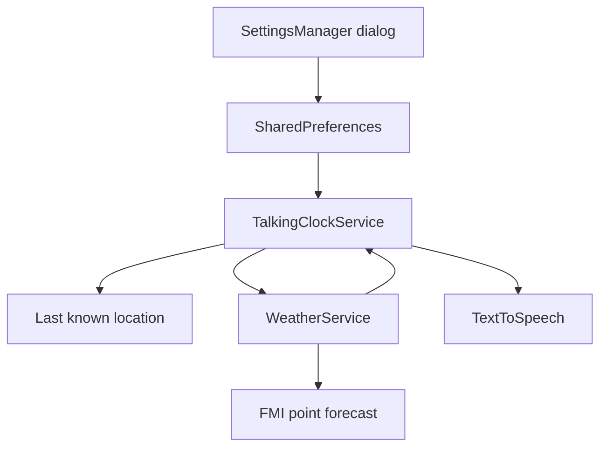

# Requirements

### Overview & Goals
Lisätään puhuvaan kelloon valinnainen FMI:n sääennuste, joka haetaan puhelimen nykyiseen sijaintiin ja liitetään kellonajan puheeseen vain käyttäjän valitsemilla ennustetunneilla.

### Scope
**In scope**
- Asetus `Kerro sääennuste`, oletuksena pois päältä.
- Kun pääasetus on päällä, näkyvät valittavat ennustetunnit `1 h päähän`, `3 h päähän`, `6 h päähän` ja `12 h päähän`; `3 h päähän` on oletuksena valittuna.
- Jokaiselle valitulle tunnille valitaan FMI:n saatavilla olevista ennusteriveistä ajallisesti lähin rivi.
- Puhe sisältää lämpötilan, pilvisyystulkinnan, sadetulkinnan, keskituulen, puuskatuulen ja kahdeksansuuntaisen tuulitulkinnan.
- Ennustetta ei haeta, jos kellopalvelulla ei ole sijaintia.

**Out of scope**
- Sääennusteen näyttäminen kartalla tai erillisessä sääruudussa.
- Historiallisten havaintojen muuttaminen ennusteeksi.
- Uusien sijaintilupien lisääminen, koska tarvittavat luvat ja kellon sijaintiseuranta ovat jo olemassa.

### Functional Requirements
- Pääasetus tallennetaan `settings`-SharedPreferencesiin oletusarvolla `false`.
- Tuntivalinnat tallennetaan erillisinä boolean-asetuksina, ja niiden käyttöliittymä näkyy vain pääasetuksen ollessa valittuna.
- Ennuste haetaan FMI:n `fmi::forecast::harmonie::surface::point::simple`-kyselyllä nykyisillä koordinaateilla ja parametreilla `Temperature`, `WindSpeedMS`, `WindGust`, `WindDirection`, `Precipitation1h`, `TotalCloudCover`.
- Puhe muodostetaan esimerkiksi muotoon: `Sää kolmen tunnin päästä: +15 astetta, puolipilvistä, ei sadetta. Tuuli lounaasta 4 metriä sekunnissa, puuskissa 11 metriä sekunnissa.`
- Pilvisyys tulkitaan rajoilla: `0–20` selkeää, `20–33` melkein selkeää, `33–72` puolipilvistä, `72–93` pilvistä ja `93–` täysin pilvistä.
- Sade tulkitaan rajoilla: `0–0,025` sateetonta, `0,025–0,4` heikkoa sadetta, `0,4–4` sadetta ja `4–` runsasta sadetta.
- Tuulensuunta pyöristetään lähimpään kahdeksasta suunnasta: Pohjoisesta, Koillisesta, Idästä, Kaakosta, Etelästä, Lounaasta, Lännestä ja Luoteesta.
- Puheen perusosa ja muut nykyiset valinnat, kuten akku- ja aurinkotiedot, säilyvät toimivina, vaikka sääpalvelu epäonnistuu; sääosuus jätetään tällöin pois.

### Non-Functional Requirements
- Verkkohaku tehdään taustalla eikä kellon palvelua tai TTS:ää blokata.
- XML- ja tulkintalogiikka on testattavissa ilman todellista FMI-verkkopyyntöä.
- Olemassa oleva puhuvan kellon oletuskäytös ei muutu ennen kuin käyttäjä ottaa sääennusteen käyttöön.

# Technical Design

### Current Implementation
- `SettingsManager.openTalkingClockSettings()` rakentaa puhuvan kellon dialogin ohjelmallisesti ja tallentaa asetukset `settings`-SharedPreferencesiin. Auringonnousun ja -laskun ehdolliset lisävalinnat (`SettingsManager.kt:1799–1839` ja `1841–1878`) toimivat mallina tuntivalintojen näkyvyydelle.
- `TalkingClockService` seuraa sijaintia `LocationManager`illa (`TalkingClockService.kt:54–96`), ajoittaa `TALK`-tapahtumat ja muodostaa puheen `speakCurrentTime()`-metodissa (`346–377`).
- `WeatherService` sisältää FMI:n XML-yhteyden ja havaintojen ryhmittelyn (`WeatherService.kt:406–519`), mutta nykyinen toteutus käyttää asemahavaintoja eikä piste-ennusteen parametririvejä.
- Manifestissa on jo `INTERNET`, `ACCESS_FINE_LOCATION`, `ACCESS_COARSE_LOCATION` ja taustasijainnin lupa (`AndroidManifest.xml:5–16`).

### Key Decisions
- Laajennetaan nykyistä `WeatherService`-luokkaa käyttäjän valinnan mukaisesti; `TalkingClockService` kutsuu sääpalvelua ja vastaa puhetekstin yhdistämisestä.
- Haetaan yhdellä FMI-pistekyselyllä aikaväli nykyhetkestä enintään 12 tuntia eteenpäin ja valitaan kustakin käyttäjän tavoitetunnista lähin saatavilla oleva aikaleima, jotta valinnat `1` ja `3` käyttävät samaa johdonmukaista vastausta eivätkä tee erillisiä pyyntöjä.
- Ennustehaku käynnistetään vain `talking_clock_weather`-asetuksen ollessa päällä, valittuja tuntiasetuksia ollessa olemassa ja `lastKnownLocation`-arvon ollessa saatavilla.
- Puheen perusajan puhuminen säilytetään ensisijaisena; sää haetaan taustalla ja lisätään valmistuvaan puheeseen vain onnistuneista ennusteriveistä.

### Proposed Changes
- Lisää `WeatherService`en ennusteen datamalli ja taustalla suoritettava/suspend-haku, joka:
  - muodostaa UTC-muotoisen `starttime`/`endtime`-kyselyn koordinaateilla ja vaadituilla FMI-parametreilla;
  - parsii XML:n aikaleimat ja parametrinimet (`Temperature`, `WindSpeedMS`, `WindGust`, `WindDirection`, `Precipitation1h`, `TotalCloudCover`) ennusteriveiksi;
  - ryhmittelee rivit aikaleiman mukaan ja valitsee lähimmän rivin jokaiselle tavoitetunnille;
  - palauttaa puuttuvat parametrikentät sallien osittaisen ennusterivin sekä virheen ilman poikkeuksen välittämistä puheeseen.
- Lisää ennusteen formatter-/tulkintafunktiot pilvisyys-, sade- ja tuulensuunnalle sekä suomenkieliselle tuntimuodolle. Lämpötila ja tuulet muodostetaan käyttäjän esimerkin yksiköillä (`astetta`, `metriä sekunnissa`).
- Muuta `TalkingClockService.speakCurrentTime()`-polku taustalla tehtäväksi säähaun orkestroinniksi: muodosta nykyinen kellonaikateksti ja nykyiset lisätekstit, hae sää vain ehdon täyttyessä, lisää sääosiot aikajärjestyksessä ja kutsu lopuksi `speakText()`.
- Huolehdi TTS-/palvelun elinkaarasta: vanhentunut tai palvelun lopettamisen jälkeen valmistuva verkkovastaus ei aloita uutta puhetta, ja `SESSION_ENDED`-toiminnon nykyinen lopetuslogiikka säilyy.
- Lisää `SettingsManager.openTalkingClockSettings()`-dialogiin `Kerro sääennuste`-checkbox sekä sisennetty tuntiryhmä `1`, `3`, `6`, `12`; päächeckbox ohjaa ryhmän näkyvyyttä ja jokainen tunti tallennetaan erikseen.
- Lisää uudet käyttöliittymä- ja puhetekstit `app/src/main/res/values/strings.xml`-tiedostoon.

### Data Models / Contracts
- Ennusterivi sisältää `time: Long`-kentän ja parametrikartan; `WeatherService` palauttaa valittujen tuntien listan tai tyhjän tuloksen.
- Tulkintafunktiot käyttävät eksplisiittisiä raja-arvoja ja normalisoivat tuulensuunnan asteet välille `0..360`, jotta myös 0/360 asteen pohjoistuuli toimii.
- Kellopalvelun asetusten avaimet ovat esimerkiksi `talking_clock_weather`, `talking_clock_weather_1h`, `talking_clock_weather_3h`, `talking_clock_weather_6h` ja `talking_clock_weather_12h`, kaikki oletuksena `false`.

### Components
- `SettingsManager`: asetusten käyttöliittymä, näkyvyys ja SharedPreferences-tallennus.
- `WeatherService`: FMI-piste-ennusteen HTTP-haku, XML-parsinta ja lähimmän ennusterivin valinta.
- `TalkingClockService`: asetusten lukeminen, sijainnin tarkistus, puheketjun asynkroninen koordinointi ja säätekstin liittäminen.
- `strings.xml`: checkboxien ja puheessa käytettävien tekstiosien resurssit.
- `TalkingClockFormatterTest.kt` ja uudet sää-/formatter-testit: puhe- ja raja-arvologiikan regressiosuoja.

### File Structure
- Muokataan `app/src/main/java/fi/anssi/kalakartta/ui/SettingsManager.kt`.
- Muokataan `app/src/main/java/fi/anssi/kalakartta/utils/WeatherService.kt`.
- Muokataan `app/src/main/java/fi/anssi/kalakartta/service/TalkingClockService.kt`.
- Muokataan `app/src/main/res/values/strings.xml`.
- Lisätään tai laajennetaan testejä `app/src/test/java/fi/anssi/kalakartta/service/` ja `app/src/test/java/fi/anssi/kalakartta/utils/`.

### Architecture Diagram

### Risks
- FMI:n parametrinimet, tyhjät arvot tai puuttuvat ennusterivit voivat vaihdella; parseri ohittaa virheelliset kentät ja puhuu vain saatavilla olevat tiedot.
- Verkkohaku voi valmistua palvelun lopettamisen jälkeen; palvelun aktiivisuus ja `isEnding` tarkistetaan ennen puhetta.
- Rajojen täsmällinen käyttäytyminen (`20`, `33`, `72`, `93` sekä `0,025`, `0,4`, `4`) lukitaan yksikkötesteillä, jotta luokkavälit eivät jää epäselviksi.

# Testing

### Validation Approach
- Aja JVM-yksikkötestit Gradlella ja varmista, että olemassa olevat `TalkingClockFormatterTest`- ja `TalkingClockSchedulingTest`-testit säilyvät vihreinä.
- Testaa FMI XML -parseri keinotekoisella XML-syötteellä ilman verkkoyhteyttä.
- Testaa tulkintafunktiot suoraan raja-arvoilla ja väliarvoilla.

### Key Scenarios
- Oletusasetuksilla puhuva kello puhuu nykyisen kellonajan kuten ennen eikä tee sääpyyntöä.
- Kun `Kerro sääennuste` valitaan, tuntivalinnat tulevat näkyviin; valinnan poistaminen piilottaa ne mutta säilyttää asetusten hallitun oletuskäytöksen.
- Valinnoilla `1` ja `3` yksi FMI-vastaus tuottaa kaksi lähimpään saatavilla olevaan aikaleimaan perustuvaa sääosuutta oikeassa järjestyksessä.
- Sijainnin puuttuessa sääpyyntöä ei tehdä ja kellonaika puhutaan normaalisti.
- FMI-verkkovirhe, tyhjä XML tai osittainen ennusterivi ei kaada kellopalvelua eikä estä muun puheen tuottamista.

### Edge Cases
- Testaa tuulensuunnan sektorit sekä 0/360 asteen raja.
- Testaa kaikki pilvisyys- ja sademäärän rajat.
- Testaa, että lämpötila-, sade-, pilvisyys- tai tuulitieto puuttuu yksitellen ilman virheellistä tekstiä.
- Testaa, ettei myöhäinen säävastaus puhu enää `SESSION_ENDED`-tilan tai palvelun tuhoamisen jälkeen.

# Delivery Steps

### ✓ Step 1: Laajenna FMI WeatherService ennusteille
`WeatherService` pystyy hakemaan ja jäsentämään FMI:n koordinaattipohjaisen piste-ennusteen valituille tavoitetunneille.
- Lisää ennusteen datamalli sekä UTC-aikavälin ja vaadittujen parametrien muodostus.
- Toteuta XML-rivien ryhmittely aikaleiman mukaan ja lähimmän saatavilla olevan rivin valinta.
- Lisää pilvisyys-, sade- ja tuulensuuntatulkinnat sekä puheeseen sopivat säätekstin muodostimet.
- Lisää parseri- ja rajaarvotestit `app/src/test/java/fi/anssi/kalakartta/utils/`-hakemistoon.

### ✓ Step 2: Lisää sääennusteen asetukset kellodialogiin
Puhuvan kellon asetuksissa on oletuksena pois päältä oleva `Kerro sääennuste` ja sen alla ehdollisesti näkyvät tuntivalinnat, joista `3 h päähän` on oletuksena valittuna.
- Muokkaa `SettingsManager.openTalkingClockSettings()`-dialogia nykyisten auringonnousu- ja auringonlaskuvalintojen mallin mukaisesti.
- Tallenna pääasetus ja valinnat `settings`-SharedPreferencesiin.
- Lisää tarvittavat käyttöliittymätekstit `app/src/main/res/values/strings.xml`-tiedostoon.
- Varmista, että asetusten muuttaminen ei käynnistä turhaa hakua ennen seuraavaa kellopuhetta.

### ✓ Step 3: Liitä ennuste puhuvan kellon puheeseen
`TalkingClockService` lisää valitut lähimmät sääennusteet kellonaikapuheeseen ilman sijainti- tai verkkovirheiden vaikutusta muuhun kellotoimintaan.
- Lue sääasetukset ja käytä `lastKnownLocation`-sijaintia vain sen ollessa saatavilla.
- Kutsu `WeatherService`ä taustalla `TALK`-puheen yhteydessä ja yhdistä valmis sääteksti nykyiseen kellonaika-, aurinko- ja akkupuheeseen.
- Estä vanhentuneen vastauksen puhe palvelun lopettamisen tai `SESSION_ENDED`-tilan jälkeen.
- Laajenna `app/src/test/java/fi/anssi/kalakartta/service/`-testit kattamaan säätekstin liittäminen ja nykyisen puhekäytöksen regressiot.