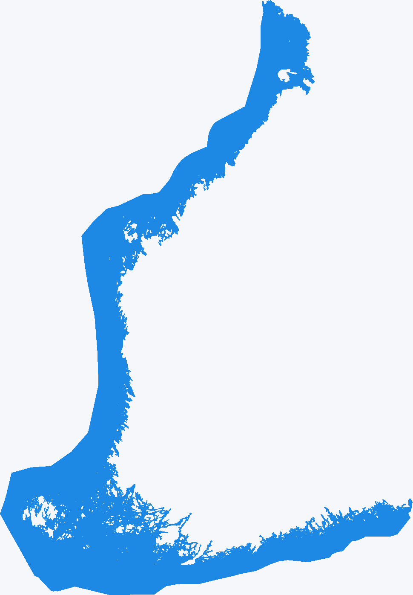

# Finland sea grid

This document describes the offline-generated asset used by the standalone
`FinlandSeaService`. The Android runtime does not download source data or
process geometries.

## Source data

The source is the Finnish National Land Survey (`Maanmittauslaitos`, MML)
Maastotietokanta GeoPackage. The generator accepts the official GeoPackage
download from Karttapaikka, including a whole-country file or a file covering
the required coastal area.

Only these MML classes are accepted:

- `Merivesi (64/36211)` polygons (`kohdeluokka = 36211`)
- `Meren rantaviiva (30223)` lines (`kohdeluokka = 30223`)

The sea class is intentionally read separately from `Järvivesi (36200)` and
other water classes. The generator stops when either class, its geometry, or a
source CRS is missing. It also rejects invalid geometries and unexpected
geometry types instead of silently producing an incomplete asset.

## Reproducible generation

Install the offline tools with Python 3:

```text
python -m pip install -r tools/requirements-finland-sea-grid.txt
```

Generate the default asset path from the project root:

```text
python tools/finland_sea_grid_generator.py path\to\mtkmaasto.gpkg
```

The default output is
`app/src/main/assets/finland_sea_grid.bin`. A different output and explicit
GeoPackage layers can be supplied when a download uses non-standard layer
names:

```text
python tools/finland_sea_grid_generator.py path\to\mtkmaasto.gpkg `
  --sea-layer <sea-layer> `
  --shoreline-layer <shoreline-layer> `
  --class-field kohdeluokka `
  --output app\src\main\assets\finland_sea_grid.bin
```

The source CRS is read from every selected layer and transformed with
`pyproj` using `always_xy=True` to EPSG:3067 (ETRS-TM35FIN). No coordinate
projection is approximated in Python or on Android.

The transformed sea polygons are unioned with one another. The allowed mask
is the intersection of that sea union and the shoreline buffer at exactly
`50,000` metres in EPSG:3067. The implementation evaluates the equivalent
distance predicate in bounded tiles instead of materialising the nationwide
buffer at once; this keeps memory use bounded without changing the mask
definition. The result is therefore limited to MML sea polygons within 50 km
of the MML sea shoreline; the buffer cannot turn a lake or inland land area
into sea.

Each 500 m cell is classified using:

```text
cellPolygon.intersection(allowedSea).area > 0
```

The cell centre is not used for classification. The output grid covers the
sea extent relevant to the shoreline mask; cells outside the allowed mask
remain zero. The generator processes bounded tiles, sets bits from positive
intersection areas, and verifies the final file size.

## Binary format v1

All multi-byte values are little-endian. The 40-byte header is:

| Offset | Field | Type/value |
|---:|---|---|
| 0 | magic | ASCII `KSEA` |
| 4 | version | unsigned 16-bit, `1` |
| 6 | header size | unsigned 16-bit, `40` |
| 8 | cell size | unsigned 32-bit, `500` |
| 12 | originX | signed 64-bit EPSG:3067 easting in metres |
| 20 | originY | signed 64-bit EPSG:3067 northing in metres |
| 28 | columns | unsigned 32-bit |
| 32 | rows | unsigned 32-bit |
| 36 | payload bytes | unsigned 32-bit |

The payload index is `row * columns + column`; columns increase eastward and
rows northward. Cell index 0 uses bit 7 of payload byte 0, then bit 6, down to
bit 0. The next cell starts at bit 7 of the next byte. Unused low bits of the
last byte are zero. The payload length is exactly
`ceil(columns * rows / 8)`.

`SeaGridBinaryReader` rejects bad magic, version, header or cell size,
non-positive or overflowing dimensions, implausible EPSG:3067 origins,
payload-size mismatches, non-zero unused bits, and any file whose total length
is not exactly `40 + payload bytes`.

## Runtime and accuracy limits

`FinlandSeaService.fromAssets(context)` loads this file from Android assets.
`isSea(latitude, longitude)` validates WGS84 ranges, transforms the coordinate
from EPSG:4326 to EPSG:3067 with Proj4J, and reads one bit from the grid.
Invalid values, including `NaN`, infinities, and coordinates outside the
latitude/longitude ranges, return `false`.

The result is a conservative 500 m-cell classification: a cell is true even
when only a positive-area sliver intersects the allowed sea. It is not a
precise shoreline test. MML source version, generalisation, download date,
and output dimensions must be recorded alongside each generated asset.

## Validated asset

The asset was generated on `2026-09-22` from an official MML-derived
GeoPackage in EPSG:3067. The input layers were `sea` and `shoreline`, with
classes `36211` (`Merivesi`) and `30223` (`Meren rantaviiva`). The resulting
file is `169,184` bytes with origin `(59,500, 6,603,500)`, dimensions
`970 × 1,395`, and `169,144` payload bytes; `237,499` payload bits are set.

The following geographic checks were made against this asset:

- `true`: Suomenlahti (`60.0, 25.5`), Pohjanlahti (`63.5, 21.5`), and
  Ahvenanmaan merialue (`60.0, 19.8`), Särkisalo (`60.132489, 22.898085`),
  Hangon edusta ulkona (`59.822092, 22.645795`), Mossala
  (`60.301151, 21.392096`), Porin edusta (`61.608949, 21.136415`),
  Ahvenanmeri (`60.238244, 19.274199`), and Kemijokisuu
  (`65.755745, 24.373240`).
- `false`: Helsinki (`60.1699, 24.9384`), Jyväskylä (`62.2426, 25.7473`),
  Joutsa (`61.74, 26.12`), Suonteen alue (`61.72, 26.35`), Björkboda
  Träsk, Kemiönsaari (`60.077577, 22.569815`), Kauniaisten Gallträsk
  (`60.218908, 24.730277`), Bodomjärvi Eteläranta (`60.241064, 24.661880`),
  Säkylän Pyhäjärvi (`61.000792, 22.300922`), Suontee
  (`61.712211, 26.266856`), Ruotsi, manner (`63.092523, 12.704246`),
  Norjanmeri (`64.622158, 8.925556`), and Sodankylä
  (`67.415421, 26.590946`).
- The projected cell with origin `(379000, 6640000)` has a positive sea
  intersection of approximately `747.7 m²` and is marked true. Its cell-centre
  query coordinate is `59.882119, 24.842572` WGS84, demonstrating that a small
  positive intersection—not the cell centre—is sufficient.

### Visual inspection



The image shows sea cells in blue and non-sea cells in light gray. It is a
direct rendering of the binary payload, with the northward grid direction
flipped for normal image coordinates. Regenerate it after updating the asset:

```text
python tools/render_finland_sea_grid.py
```

## Finer than 500 m cells

The current v1 format and Android reader intentionally support only `500 m`
cells. The generator's `CELL_SIZE` constant and the Kotlin reader's fixed
`CELL_SIZE` validation must therefore be changed together; changing only the
Python constant would create an asset that the application correctly rejects.

To produce a finer grid later:

1. Choose a cell size in metres, for example `250`, and estimate the resulting
   dimensions and payload before running the full-country job. Halving the
   cell size makes the cell count roughly four times larger and may also make
   rasterisation substantially slower.
2. Change `CELL_SIZE` in
   `tools/finland_sea_grid_generator.py`, and pass that value into the header
   instead of treating `500` as an implicit constant.
3. Update `FinlandSeaGrid.kt` and `SeaGridBinaryReader` so that the supported
   cell size is read from the header, validated as a positive supported value,
   and used for origin alignment, bounds, and coordinate-to-cell calculations.
   Prefer a new binary format version for this change, or keep v1 explicitly
   500 m-only and add a separately versioned format for variable cell sizes.
4. Extend `SeaGridBinaryReaderTest` with the new header value, origin and
   boundary calculations, payload-size checks, and rejection of unsupported
   sizes. Regenerate the geographic service tests because a finer grid can
   change shoreline-adjacent answers.
5. Generate the new asset to a temporary output first, inspect its header and
   visualisation, run the geographic checks and the full unit-test task, and
   replace `app/src/main/assets/finland_sea_grid.bin` only after those checks
   pass. Record the new dimensions, payload size, source release and command
   in this document.

Do not commit a smaller-grid file while the Android reader still enforces v1
with `500 m`; that would make application startup fail when the asset is
loaded. A finer grid also does not remove the source-data uncertainty or the
conservative rule that any positive-area sea intersection marks the whole cell.

## Runtime integration boundary

The service is currently safe to keep in the application without changing
existing user flows: it is not referenced by activities, controllers,
repositories, Room, GPS handling or map rendering. `fromAssets(context)` loads
the validated asset only when a caller explicitly creates the service, and
`isSea` is a synchronous, read-only query.

The planned sea-level feature can use `FinlandSeaService.isSea(latitude,
longitude)` as a classification step before requesting or interpreting sea
water-level data. Keep that network lookup and its lifecycle outside this
service; this grid is offline reference data, not a water-level or navigation
source.

## Updating

1. Download a current MML Maastotietokanta GeoPackage covering all required
   sea areas.
2. Install the pinned-compatible Python dependencies.
3. Run the generator and record the source release/date, selected layers,
   source CRS, command, output size, dimensions, and payload size.
4. Inspect the header and run `SeaGridBinaryReaderTest` plus the full unit-test
   task before committing the asset.
5. Commit the binary only after its source and geographic validation are
   available; do not substitute hand-written or all-water geometry.
